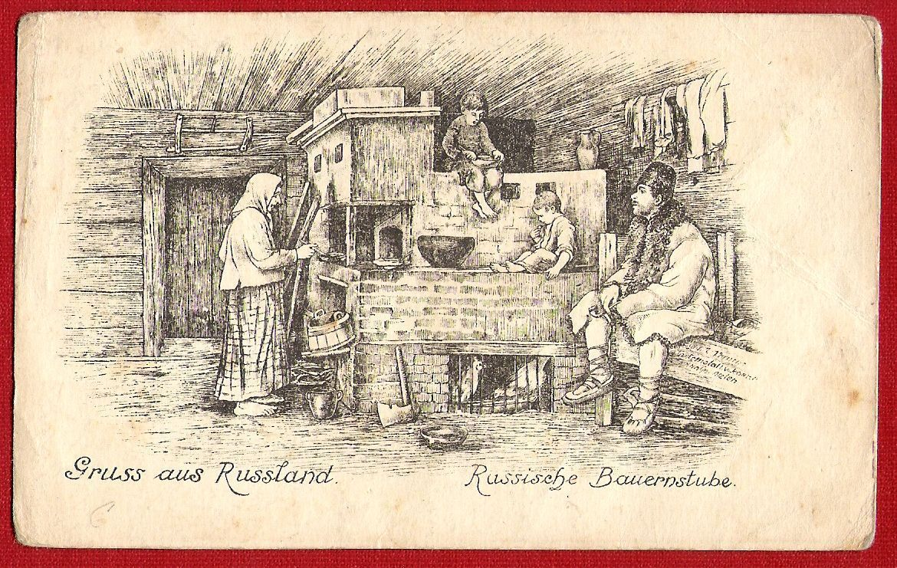
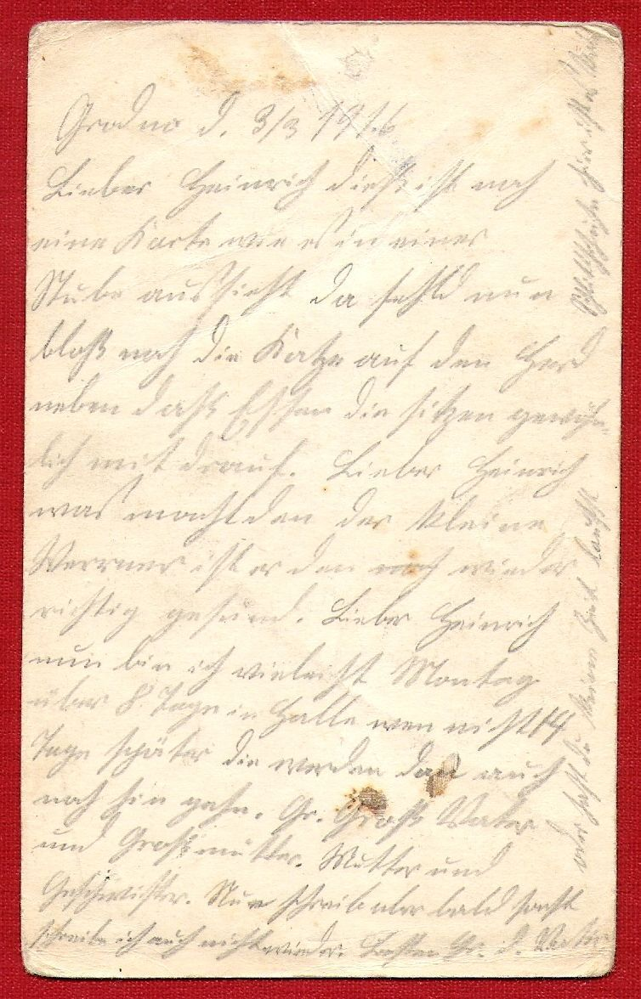

- [ref](http://www.ebay.at/itm/Postkarte-Gruss-aus-Russland-Bauernstube-gelaufen-Grodno-1916-/361512487277)
- печатные надписи на лицевой стороне
  - Gruss aus Russland
  - Russische Bauernstube
- рукописаный текст на обороте
  - Grodno 9. 9/3 1916

## Resources

- https://www.ak-ansichtskarten.de/ak/90-Alte-Ansichtskarte/1054-Trachten-Russland-Baltische-Staaten/4859057-AK-Typische-russische-Bauernstube-mit-einer-Familie
