## Восстановление. 1928 год

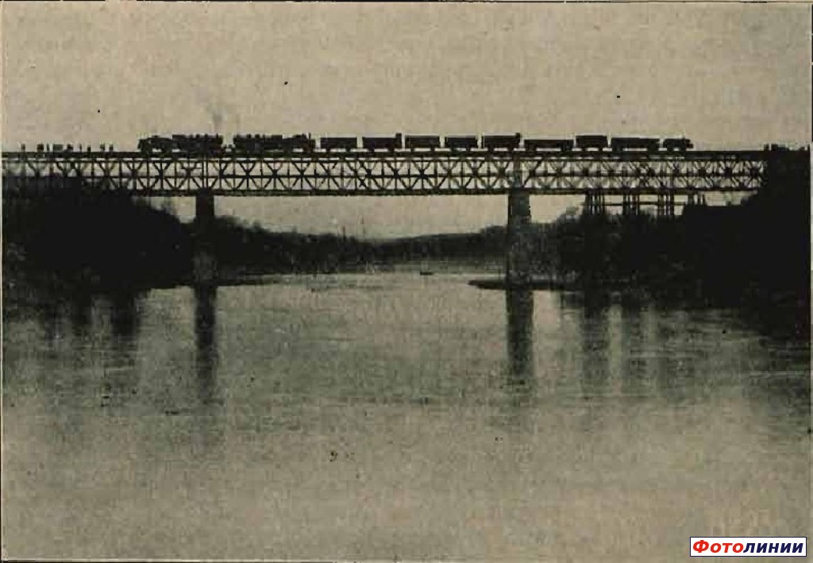

- [ref](http://railwayz.info/photolines/photo/72174)
  - Грузовой поезд на мосту через Нёман, восстановленном после І Мировой войны.
  - Источник: [Inżynier Kolejowy, Nr. 11, 1928 год][ik-11-28]

> Most na rzece Niemnie pod Grodnem. Widok mostu odbudowanego (filary pod dwa tory, kratownice żelazne syst. Roth-Wagnera pod torem prawym)

> rozp. teoret. 2 X 57 + 69 m.

- опоры под два пути
- железная ферма системы Roth-Wagnera под правым путём

[ik-11-28]: http://bcpw.bg.pw.edu.pl/dlibra/docmetadata?id=5411&from=publication

- TODO http://bcpw.bg.pw.edu.pl/Content/3823/22pt1923_nr21.pdf page 9

## Восстановление немцами

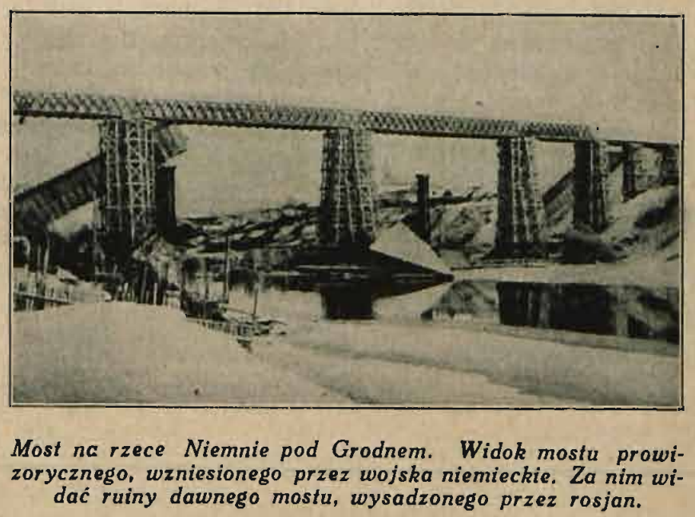

> Most na rzece Niemnie pod Grodnem. Widok mostu prowizorycznego, wzniesionego przez wojska niemieckie. Za nim widać ruiny dawnego mostu, wysadzonego przez rosjan.

- page 54 from [ik-11-28][]

## Подрыв в первую мировую

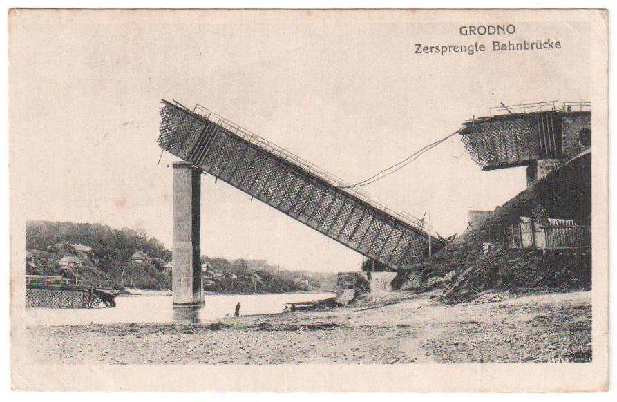

- [ref](http://railwayz.info/photolines/photo/11531)
- надписи
  - Grodno
  - Zersprengte Bahnbrücke
- обратить внимание
  - на последующих карточках не видно висящих рельс

![][first-bang]
[first-bang]: 4487160.jpg

- [ref 1][first-bang-ref]
[first-bang-ref]: http://www.europeana.eu/portal/en/record/92033/BibliographicResource_3000053562905.html

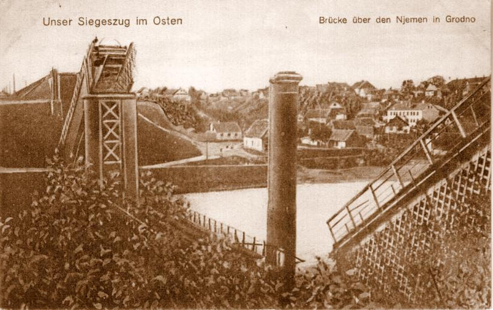

- [ref](http://railwayz.info/photolines/photo/4177)
  - 17.03.1916, вероятно дата отправления открытки

![][first-bang-reverse]
[first-bang-reverse]: 4487150.jpg
[first-bang-reverse-ref]: http://www.europeana.eu/portal/en/record/92033/BibliographicResource_3000053563024.html

- [ref 2][first-bang-reverse-ref]
- Zersprengte Bahnbrücke
  - [first-bang-ref][]

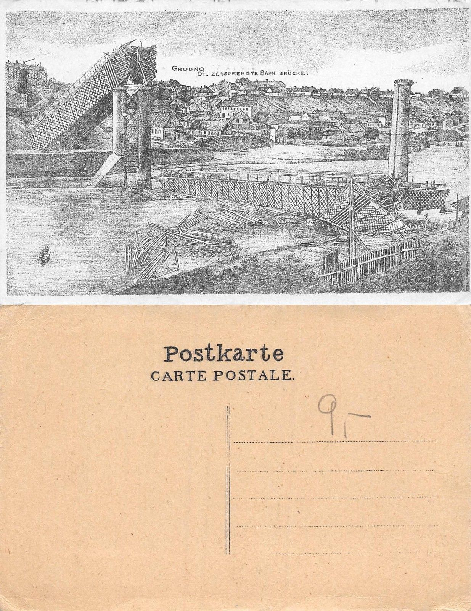

- [ref](http://www.ebay.com/itm/Bielorussia-Grodno-Hrodna-Zersprengte-Bahn-Brucke-A-L-285-/361493281953)
- надписи
  - Grodno
  - Die Zersprengte Bahn-brücke.
    - ru. разрушенный железнодорожный мост
  - Postkarte
  - Carte postale.

---

Обратить внимание:
- после разрушения, на почтовых карточках используется Bahnbrücke
- до разрушения - Eisenbrücke и Eisenbahnbrücke

## 50 лет эксплуатации

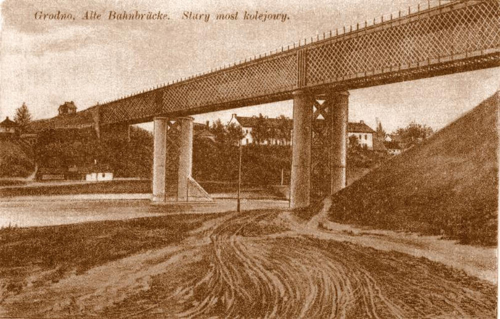

- [ref](http://railwayz.info/photolines/photo/4178)
  - 27.08.1916, вероятно дата отправления открытки
- надписи
  - Grodno. Alte Bahnbrücke. Stary most kolejowy.
    - ru. старый железнодорожный мост
- почему мост называется старый?

![][1914-se]
[1914-se]: 1288353806.jpg

- [ref](http://railwayz.info/photolines/photo/11532)
  - 1914
- перспектива юго-восток
- печатные надписи
  - Die Eisenbahnbrücke
  - Grodno

---

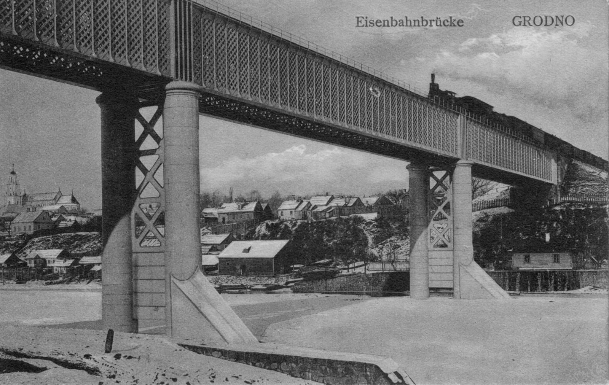

- [ref][GrodnoBridge2]
- Eisenbahnbrücke
- Grodno

[GrodnoBridge2]: https://commons.wikimedia.org/wiki/File:GrodnoBridge2.jpg

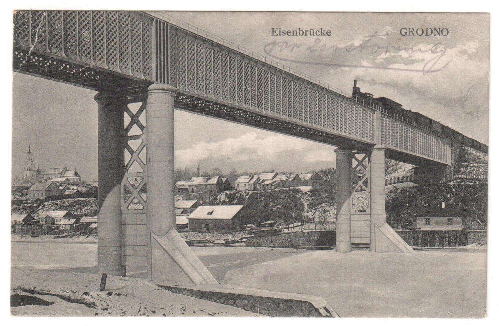

- [ref](http://railwayz.info/photolines/photo/5916)
  - указана дата 26.02.1915, вероятно дата отправления открытки
- перспектива северо-запад
- печатные надписи
  - Eisenbrücke
  - Grodno

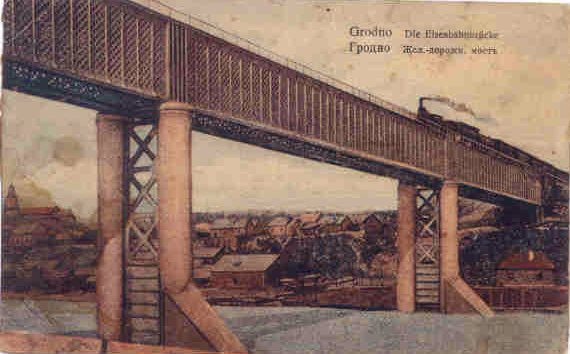

- [ref][GrodnoBridge2]

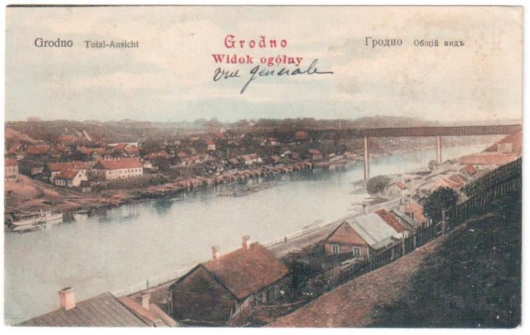

- [ref](http://railwayz.info/photolines/photo/11533)
  - ??.??.1914, возможно дата отправления открытки
- надписи
  - Grodno
  - Total-Ansicht
  - Widok ogólny
  - Гродно
  - Общій видъ

## Строительство

- В 1864 году был открыт железнодорожный мост
  - ref http://www.newsby.org/news/2007/11/29/text1558.htm
- Most kolejowy [na Niemnie pod Grodnem na linji Warszawa - Wilno, zbudowany w r. 1862.
  - ref http://bcpw.bg.pw.edu.pl/dlibra/docmetadata?id=5411&from=publication

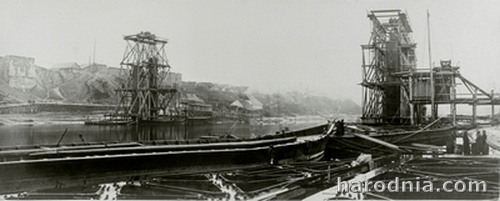

- [ref][harodnia-150]
  - Budownictwo mostu kolejowego na zdjęciach, zrobionych przez Antona Rorbacha. Listopad 1861 roku.
- see [Anton Rorbach](anton-rorbach.md)

[harodnia-150]: http://harodnia.com/pl/grodno-wczoraj/518-od-warszawy-do-petersburga-150-lat-pierwszej-kolei-na-grodzie-szczy-nie

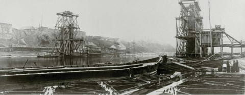

- [ref](http://kresy24.pl/koleja-z-warszawy-do-petersburga-przez-grodno/)

## Resources

- http://www.europeana.eu/portal/en/record/92033/BibliographicResource_3000053562926.html
- РГИА, ф. 1287, оп. 6, д. 1563, л. 7. «Прошение жителей г. Гродно об устройстве в городе станции Петербургско-Варшавской ж. д.» 1860 г.
  - [ref][ru-wiki-rw]
- о Поречье и контексте строительства
  - http://grodnonews.by/category/istoriya/news10867.html

[ru-wiki-rw]: https://ru.wikipedia.org/wiki/%D0%9F%D0%B5%D1%82%D0%B5%D1%80%D0%B1%D1%83%D1%80%D0%B3%D0%BE-%D0%92%D0%B0%D1%80%D1%88%D0%B0%D0%B2%D1%81%D0%BA%D0%B0%D1%8F_%D0%B6%D0%B5%D0%BB%D0%B5%D0%B7%D0%BD%D0%B0%D1%8F_%D0%B4%D0%BE%D1%80%D0%BE%D0%B3%D0%B0
